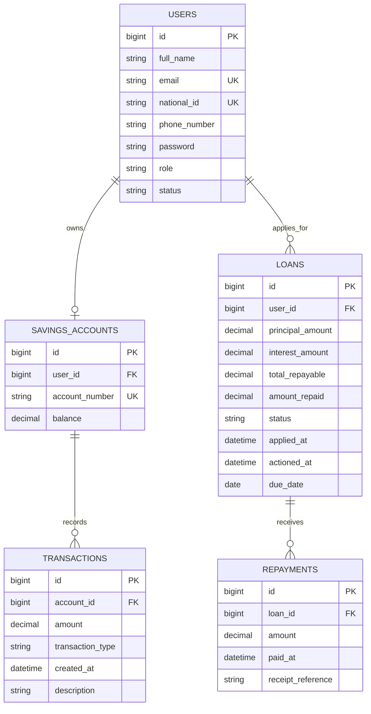

# Kimwanyi SACCO Database Schema

Relationship summary:

- One member user can own one savings account.
- One member user can have many loan records over time.
- One savings account can have many deposit, withdrawal, and interest transactions.
- One loan can have many repayment records.
